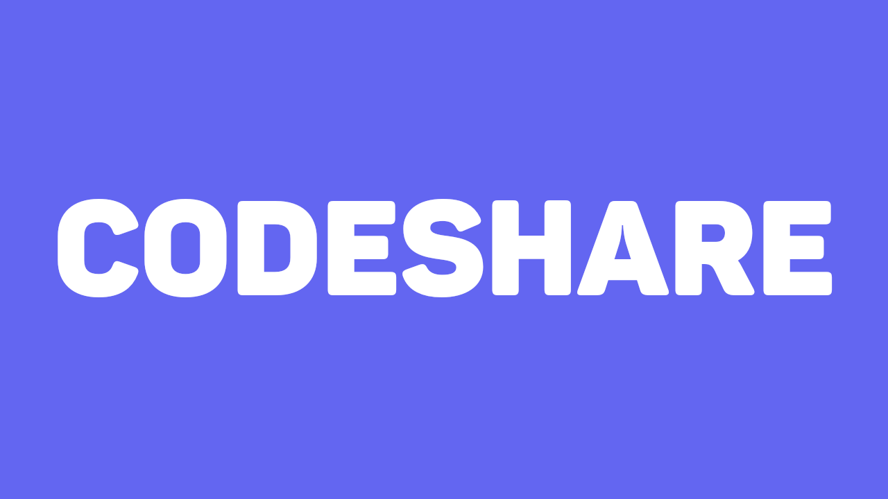

# CodeShare

CodeShare is a web application that allows users to store text snippets and access them easily using a unique 6-letter code. This repository contains the code for both the frontend and backend of the application.

## Table of Contents

- [Features](#features)
- [Technologies](#technologies)
- [Setup](#setup)
  - [Prerequisites](#prerequisites)
  - [Installation](#installation)
- [Usage](#usage)
- [API Endpoints](#api-endpoints)
- [Contributing](#contributing)
- [License](#license)

## Features

- Store text snippets with a unique 6-letter code.
- Retrieve stored text using the unique code.
- Update and delete text snippets.
- Responsive UI built with React and Material-UI.
- Backend API built with Go and Echo framework.
- Database operations handled using GORM with PostgreSQL.

## Technologies

- **Frontend**: React, Next.js, Material-UI, Axios, Tailwind CSS
- **Backend**: Go, Echo, GORM
- **Database**: PostgreSQL
- **Containerization**: Docker, Docker Compose

## Setup

### Prerequisites

- Docker
- Docker Compose
- Node.js and npm (for frontend development)

### Installation

1. **Clone the repository:**

   ```bash
   git clone https://github.com/arkorty/codeshare.git
   cd codeshare
   ```

2. **Set up environment variables:**

   Create a `.env.local` file in the root of the frontend and add the following:

   ```env
   NEXT_PUBLIC_BACKEND_URL=http://localhost:8080
   ```

3. **Run the application using Docker Compose:**

   ```bash
   docker-compose up --build
   ```

   This command will build and start the Docker containers for the frontend, backend, and PostgreSQL database.

4. **Access the application:**

   Open your browser and navigate to `http://localhost:3000` to access the frontend. The backend API will be available at `http://localhost:8080`.

## Usage

### Creating a Paste

1. Enter the title and content in the provided text fields on the homepage.
2. Click the "Create Paste" button.
3. You will be redirected to a page displaying the unique 6-letter code for the paste.

### Retrieving a Paste

1. Navigate to `http://localhost:3000/{pasteID}` where `{pasteID}` is the unique 6-letter code.

### Updating a Paste

1. Retrieve the paste using its unique code.
2. Edit the title and/or content.
3. Click the "Update Paste" button.

### Deleting a Paste

1. Retrieve the paste using its unique code.
2. Click the "Delete Paste" button.

## API Endpoints

- **GET `/pastes`**: Retrieve all pastes.
- **POST `/pastes`**: Create a new paste.
- **GET `/pastes/:id`**: Retrieve a paste by ID.
- **PUT `/pastes/:id`**: Update a paste by ID.
- **DELETE `/pastes/:id`**: Delete a paste by ID.

## Contributing

We welcome your contributions! Whether it's fixing bugs, adding features, or improving documentation, your help is appreciated. Feel free to report issues or submit pull requests. Thank you for helping make CodeShare better!

## License

This project is licensed under the MIT License - see the [LICENSE](LICENSE) file for details.
